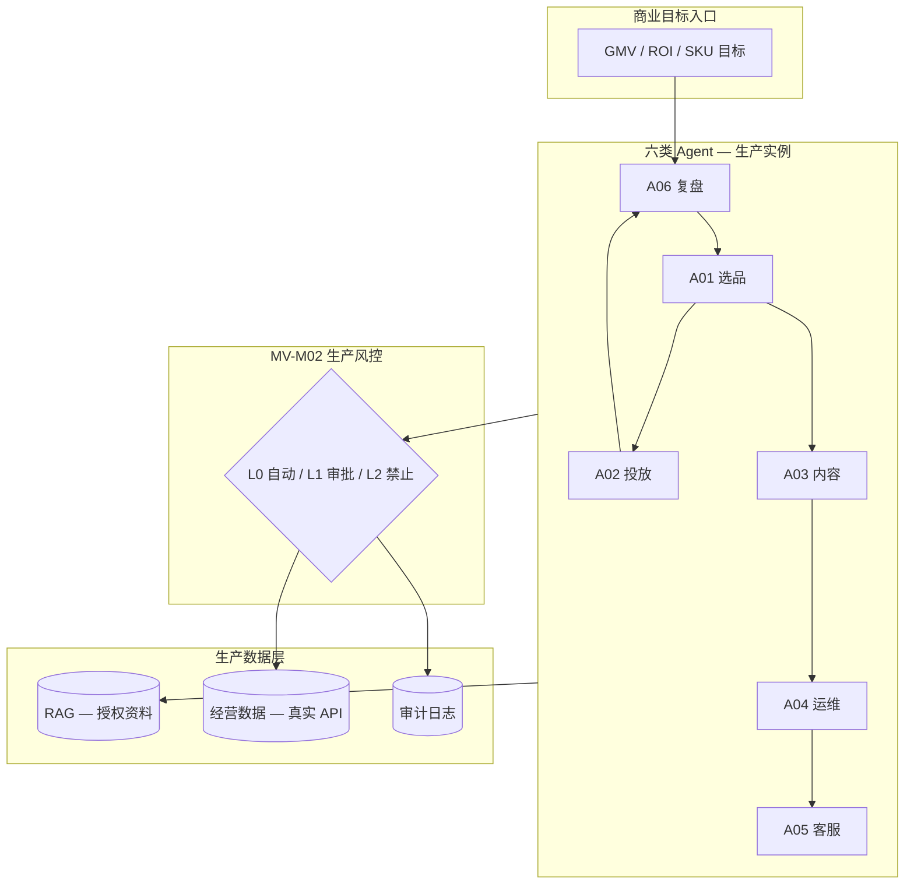

# 管理岗 — 生产商业级扩展计划（Phase 2 Master Plan）

| 属性 | 值 |
|------|-----|
| **文档代号** | MV（Manager Vision → **生产扩展 Phase 2**） |
| **版本** | v1.1.0 |
| **计划性质** | **生产商业级交付计划**（非远景、非演示、非作品集） |
| **计划状态** | `APPROVED` — 用户于 2026-08-30 回复「开启 MV 生产计划」 |
| **需求来源** | `Desktop/111/` — **AI 电商 Agent 负责人** JD（2026-08-29） |
| **与 Launch AEO 关系** | Phase 1 完成后的 **Phase 2 生产扩展**；不修改 [`01_MASTER_PLAN.md`](01_MASTER_PLAN.md) 直至 CR 合并 |
| **制定日期** | 2026-08-30 |
| **预估规模** | 约为 Launch AEO 首期（MS0–MS7）的 **4–6 倍**交付工作量 |

> **定位说明：** 本计划定义的是**可上线、可度量 ROI、可替代人工运营动作**的商业级系统交付目标。每一里程碑均须满足 **生产门禁**（§8）方可标记 `completed`，不得以 demo / POC 代替验收。  
> **叙事禁令（2026-08-30）：** 项目对外与文档内**禁止**使用「面试」「作品集」「转岗」「演示视频」等表述定位本产品；统一使用 **生产验收、商业试点、运营签收、ROI/替代率**。
> **开启条件：** 用户回复「**批准 MV 计划**」或「**开启 MV 生产计划**」→ 状态 `APPROVED`，进度表方可执行。 ✅ 已于 2026-08-30 批准。  
> **MV1 开工前：** 仍须 Launch AEO **MS7 生产验收通过** + MV0-02（SP-API 可行性）确认。

---

## 1. 生产商业级总目标

### 1.1 交付目标（必须达成）

在 Launch AEO Phase 1（Listing 模块生产可用）基础上，交付一套**可 7×24 运行、对接真实店铺数据、以 GMV/ROI 验收**的 AI 电商自主运营系统，覆盖：

> 市场调研 → 智能选品 → Listing/内容 AIGC → 投流建议与执行（人审）→ 店铺运维 → 客服履约 → 数据复盘与策略迭代

**生产级定义（强制）：**

| 维度 | 要求 |
|------|------|
| **可用性** | 核心 API 月度 ≥ 99.5%（继承 `05` P-AVL-01） |
| **数据** | 真实店铺经营数据接入（非样例 MD）；审计可追溯 |
| **风控** | 写操作默认 L1 人审；违规自动化 0 容忍 |
| **商业验收** | 每阶段须有可对比的 ROI / 人工替代率实测报告 |
| **运维** | prod compose、监控告警、回滚预案、密钥轮换 |
| **合规** | 仅授权 API；日志脱敏；禁止未授权数据入库 |

### 1.2 与 Launch AEO Phase 1 的关系

```
Phase 1 — Launch AEO（01_MASTER_PLAN，进行中）
└── 生产交付：Listing 优化全链路 + 20 SKU 试点（MS7）
    └── 验收：运营无需 CLI、SLA 达标、prod 可部署

Phase 2 — 本计划 MV（DRAFT / ON_HOLD）
└── 生产交付：六类 Agent + 全链路 + 50 SKU 商业试点（MV5）
    └── 验收：人工替代率 ≥ 40%、ROI 不低于人工 p50、0 风控事故
```

| Phase 1 已交付（生产） | Phase 2 须新增（生产） |
|------------------------|------------------------|
| Listing Agent 链 + HITL | 选品 / 投放 / 运维 / 客服 / 复盘 Agent |
| RAG（规则/产品/SOP） | + 订单、广告、库存、GMV 经营数据层 |
| 任务级运营指标 | + GMV、ROI、人工替代率商业闭环 |
| Amazon/TikTok Listing | + SP-API、广告、客服、独立站只读 |

### 1.3 范围内（In Scope — 生产必须交付）

- 六类 Agent **生产可用**（非 stub）：可调度、可审计、可降级
- **MV-M10 数据集成层**：SP-API / 订单 / 广告数据 ingest（真实环境）
- **MV-M02 风控引擎**：L0/L1/L2 分级 + 全写操作审计
- **MV-M09 商业指标**：GMV/ROI/人工替代率自动采集 + 看板 + 批跑报告
- 全链路在 **Amazon（主）** 生产试点；TikTok / 独立站按阶段纳入
- 继承并扩展 `03`/`04`/`05` 规范；MV 专用 SLA 见 §7

### 1.4 范围外（Out of Scope）

- 多租户 SaaS 计费
- 模型微调（LoRA）— MV-Phase 5 可选
- 绕过平台风控 / 验证码
- 未授权店铺 API、内部未公开数据
- 纯演示 / 无真实店铺数据的「假试点」
- JD 中的组织管理职能（招人、带团队）

---

## 2. 需求溯源（管理岗 JD → 生产交付项）

需求原件：`D:\Users\fanxiaoyi\Desktop\111\`

| JD 要求 | 生产交付物（可验收） | 模块 |
|---------|---------------------|------|
| 六类 Agent 分工 + 任务调度 | 多图编排 + 指挥台 + 调度 API | MV-M01 |
| 自主运营规则 + 风控 | 规则引擎 + 审计表 + 配置 UI | MV-M02 |
| 全链路电商场景 | 端到端任务类型 ≥ 6 种，均可生产执行 | MV-M03~08 |
| Function Call + RAG + 记忆 | 工具注册表 + 会话记忆 + 知识库生产 ingest | M03 + MV-M01 |
| GMV/ROI/人工替代率闭环 | 指标表 + 看板 + 对比报告模板 | MV-M09 |
| 0-1 搭建自主运营 Agent | **非文案/生图工具**；须工具调用 + 真实数据 | 全模块 |

---

## 3. 六类 Agent（生产定义）

每个 Agent 上线须满足：**超时/重试/熔断、trace 可查、降级策略、生产测试 ≥ 80% 核心路径覆盖**。

| Agent | 生产职责 | 生产输入 | 生产输出 | 风控默认 |
|-------|----------|----------|----------|----------|
| **A01 选品** | 竞品池维护、选品评分、上架建议 | 类目/关键词/预算 | 选品报告 + 建议 SKU 列表 | L0 调研；L1 上架建议执行 |
| **A02 投放** | 广告结构、出价、预算、ROI 预估 | SP-API 广告数据 | 投放方案 + 执行单（人审） | L1 全部写操作 |
| **A03 内容 AIGC** | Listing/图文/短视频脚本 | 产品资料 + 规则 RAG | 多平台内容包 + 合规校验 | L0 草稿；L1 发布 |
| **A04 店铺运维** | 调价、库存联动、活动 | 库存/价格 API | 运维工单 + 人审执行 | L1 全部写操作 |
| **A05 客服履约** | 订单/物流/售后应答 | 订单 API + RAG | 回复草稿或自动发送（可配置） | L0 查询；L1 退款/补偿 |
| **A06 复盘迭代** | 日报/周报、策略建议、下轮任务 | GMV/广告/任务指标 | 报告 + 自动创建跟进任务 | L0 报告；L1 策略执行 |

Launch AEO 现有 5 节点 = **A03 Listing 子链**（Phase 1 生产交付），不构成 Phase 2 完成。

### 3.1 生产编排拓扑



---

## 4. 模块划分（MV-M*）

| 模块 | 名称 | 生产交付标准（摘要） |
|------|------|---------------------|
| **MV-M01** | 多 Agent 平台 | 跨图调度 p95 ≤ 500ms；并发配额可配置 |
| **MV-M02** | 风控决策 | 100% 写操作过规则引擎；审计不可篡改 |
| **MV-M03** | 选品情报 | 竞品池日更；选品报告可复现 |
| **MV-M04** | 内容 AIGC | 多平台模板；合规率 ≥ 95% |
| **MV-M05** | 广告投放 | SP-API 对接；建议 vs 实际 ROI 可对比 |
| **MV-M06** | 店铺运维 | 人审执行闭环；单次改价可追溯 |
| **MV-M07** | 客服履约 | 应答准确率人工抽检 ≥ 85% |
| **MV-M08** | 独立站 DTC | Store API 只读 + 建议（Phase 3+） |
| **MV-M09** | 商业指标 | GMV/ROI/替代率 T+1 自动出数 |
| **MV-M10** | 数据集成 | 授权 API only；断点续传；数据血缘 |

---

## 5. 平台生产矩阵

| 平台 | 生产数据接入 | 生产自动化深度 | 纳入阶段 |
|------|-------------|----------------|----------|
| **Amazon** | SP-API（广告/订单/库存） | 投放/运维 L1 执行 | MV2–MV5 |
| **TikTok Shop** | Shop API / 公开页 | 内容 + 客服 | MV3–MV5 |
| **独立站** | Shopify 类 Store API | 只读巡检 + 建议 | MV4+ |
| 天猫/京东 | — | Phase 5 单独 CR | 不纳入 MV5 |

---

## 6. 风控分级（生产强制）

| 级别 | 生产行为 | 审计要求 |
|------|----------|----------|
| **L0** | 自动执行，事后审计 | 全量 trace + 保留 180 天 |
| **L1** | 中断 → 人工 approve → 执行 | approve 人、时间、diff 入库 |
| **L2** | 仅建议，系统拒绝执行 | 拒绝原因 + 告警 |

**生产默认：** 所有价格/广告/上架/退款 = **L1**；超预算/新开户 = **L2**。

---

## 7. 商业指标与 SLA（生产验收硬指标）

### 7.1 商业 KPI（MV5 终验 — 必须达标）

| 指标 ID | 定义 | 生产目标 | 测量方式 |
|---------|------|----------|----------|
| **MV-BIZ-01** | 人工替代率 | ≥ **40%** | 自动化完成任务 / 总任务（30 天滚动） |
| **MV-BIZ-02** | 广告 ROI | ≥ 人工运营同期 **p50** | SP-API 实际花费 vs 归因 GMV |
| **MV-BIZ-03** | GMV 贡献可度量 | 100% 可追踪 | Agent 链路打标 + 报表 |
| **MV-BIZ-04** | 风控事故 | **0** 起封号/重大违规 | 运营 + 审计复核 |
| **MV-BIZ-05** | 客服应答质量 | 人工抽检相关率 ≥ **85%** | 每周 50 条抽检 |
| **MV-BIZ-06** | 一次审批通过率 | ≥ **60%** | 与 Phase 1 一致 |

### 7.2 技术 SLA（继承并扩展 `05`）

| 指标 ID | 场景 | 生产目标 (p95) |
|---------|------|----------------|
| MV-P-01 | 全链路任务（含 API 调用） | ≤ **300s** |
| MV-P-02 | GMV 日报生成 | T+1 **08:00** 前完成 |
| MV-P-03 | SP-API 同步延迟 | ≤ **15min** |
| MV-P-04 | 核心 API 可用性 | ≥ **99.5%** / 月 |

### 7.3 生产门禁（每里程碑必过）

每个 MVx 完成前须通过：

1. `test.ps1` 全绿 + MV 模块测试覆盖率 ≥ **70%**
2. prod compose 部署成功 + 回滚演练 1 次
3. 真实店铺沙箱 / 试点店 实测通过（非 mock）
4. 商业指标出数验证（哪怕阶段未终验，须证明链路通）
5. 安全：密钥轮换、日志脱敏、审计抽查通过
6. 用户签字或回复「**批准 MVx**」

---

## 8. 分期里程碑（MV0–MV5）— 生产交付

> 详细任务见 [`10_MANAGER_VISION_PROGRESS.md`](10_MANAGER_VISION_PROGRESS.md)。

| 里程碑 | 名称 | 工期 | 生产交付物 | **生产验收（非 demo）** |
|--------|------|------|------------|-------------------------|
| **MV0** | 计划批准 | — | 本文档 `APPROVED` | 用户确认生产目标与 KPI |
| **MV1** | 平台 + 风控 | 8 周 | 调度器、L0/L1/L2、指标 SDK | 3 Agent 联调 + 沙箱店写操作审计全记录 |
| **MV2** | 选品 + 内容 | 10 周 | A01/A03 生产实例 | **10 个真实 SKU** 选品→内容包端到端 |
| **MV3** | 投放 + 运维 | 12 周 | A02/A04 + SP-API | **真实广告账户** 建议→人审→执行→ROI 回写 |
| **MV4** | 客服 + 复盘 | 10 周 | A05/A06 + GMV 看板 | **7 天连续** 自动日报 + 客服 50 条抽检 |
| **MV5** | 商业试点 | 8 周 | 50 SKU 多平台批跑 | **MV-BIZ-01~06 全部达标** + 试点报告 |

**总工期（MV0 起）：** 48–58 周。每阶段可独立上线，**上一阶段须生产验收通过**方可进入下一阶段。

---

## 9. 技术栈与生产架构

继承 Launch AEO Phase 1 全部技术栈；Phase 2 扩展：

| 层级 | 生产扩展 |
|------|----------|
| 数据 | `biz_orders` `biz_ads` `biz_metrics` `audit_log` 生产表 + 迁移 |
| 集成 | SP-API OAuth、token 刷新、限流队列 |
| 编排 | 多图 + 死信队列 + 任务优先级 |
| 可观测 | Prometheus 告警规则 + GMV 看板 |
| 部署 | prod profile：资源 limits、备份、secrets |

---

## 10. 风险登记

| ID | 风险 | 缓解 |
|----|------|------|
| MV-R1 | 与 Phase 1 抢资源 | MV 未批准不开工；MS7 优先 |
| MV-R2 | 无 SP-API 权限无法生产验收 | MV0 门禁：API 权限确认书 |
| MV-R3 | 用 demo 数据冒充生产试点 | 验收强制真实店铺 ID + 数据血缘 |
| MV-R4 | ROI 无法归因 | MV-M09 链路打标先行于 MV3 |
| MV-R5 | 自动化违规 | L2 默认 + 预算硬顶 + 人工复核 |

---

## 11. 开启 / 暂停 / 合并协议

| 口令 | 效果 |
|------|------|
| **批准 MV 计划** / **开启 MV 生产计划** | 本计划 `APPROVED`；MV1 可开工 |
| **批准 MVx** | 对应里程碑 `completed`（须过 §7.3 门禁） |
| **暂停 MV** | `ON_HOLD`；仅维护文档 |
| **合并 MV 至总计划** | 发起 CR → 写入 `01_MASTER_PLAN` Phase 2 |

**默认：** `APPROVED`（2026-08-30 用户批准）；MV1 待 MS7 通过后解除阻塞

---

## 12. 开启前审核清单（生产级）

- [ ] 已确认 **真实店铺 / SP-API** 可用（非仅沙箱）
- [ ] 已确认试点 SKU 清单与商业基线 ROI 数据
- [ ] 已接受 MV5 终验硬指标（替代率 40%、ROI p50、0 事故）
- [ ] Launch AEO **MS7 生产验收已通过**
- [ ] 同意每阶段走生产门禁，不以 demo 代替

---

## 13. 修订记录

| 版本 | 日期 | 变更 | 审批人 |
|------|------|------|--------|
| v1.0.0 | 2026-08-30 | 初稿 | — |
| v1.1.0 | 2026-08-30 | **重定义为生产商业级交付计划**；新增 SLA、生产门禁、分阶段真实数据验收 | 待用户 |
| v1.1.1 | 2026-08-30 | 用户批准开工（「开启 MV 生产计划」） | 用户 |
