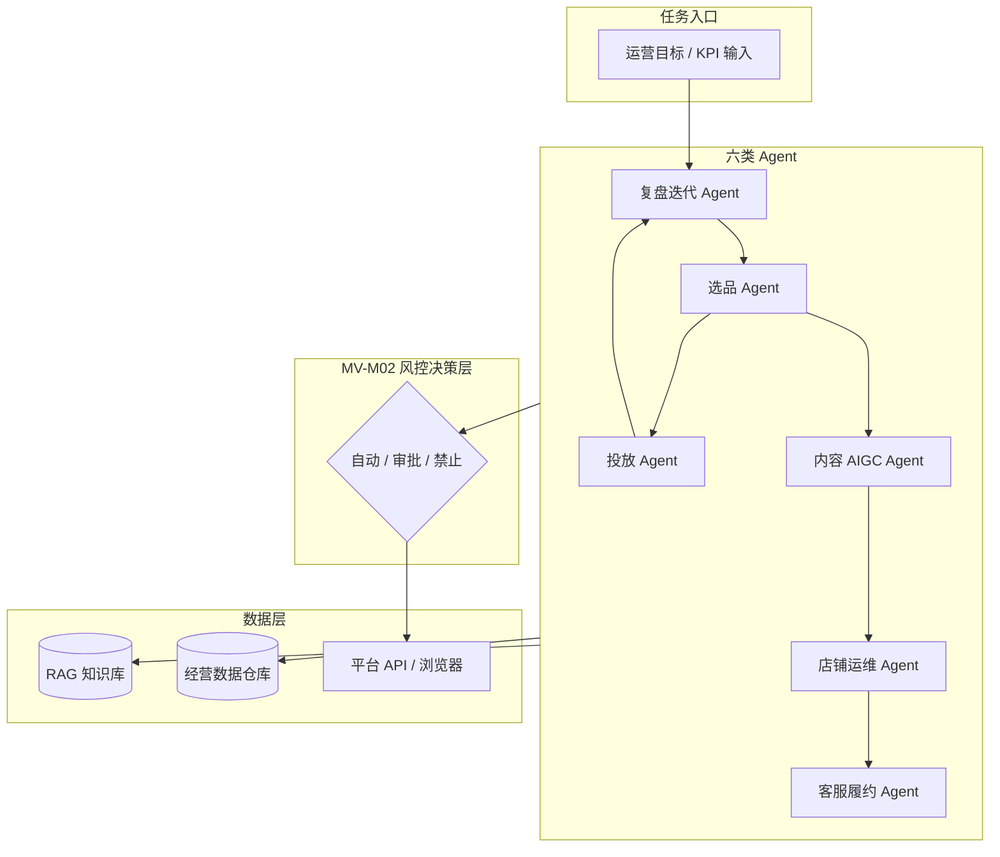

# 管理岗愿景 — 需求与总目标计划（Manager Vision Plan）

| 属性 | 值 |
|------|-----|
| **文档代号** | MV（Manager Vision） |
| **版本** | v1.0.0 |
| **计划状态** | `DRAFT` — **未开工，待用户决定是否开启** |
| **需求来源** | `Desktop/111/` Boss 直聘截图 — **AI 电商 Agent 负责人** JD（2026-08-29） |
| **与 Launch AEO 关系** | **独立愿景线**；不替代、不修改 [`01_MASTER_PLAN.md`](01_MASTER_PLAN.md) |
| **制定日期** | 2026-08-30 |
| **预估规模** | 约为当前首期（Launch AEO MS0–MS7）的 **4–6 倍**工作量 |

> **开启条件：** 用户回复「**开启管理岗愿景**」或「**批准 MV 计划**」后，本计划状态改为 `APPROVED`，进度表 [`10_MANAGER_VISION_PROGRESS.md`](10_MANAGER_VISION_PROGRESS.md) 方可作为任务执行来源。  
> **未开启前：** AI Agent **不得**按本计划编写业务代码；仅可维护本文档与进度表。

---

## 1. 愿景与边界

### 1.1 愿景（North Star）

从 0 到 1 搭建**行业领先的 AI 电商自主运营系统**，实现跨境/多平台场景下：

> 市场调研 → 智能选品 → Listing 优化 → 内容 AIGC → 智能投流/调价 → 订单与客服履约 → 库存预警 → 数据复盘与策略自迭代

系统须具备：**多 Agent 协同、策略产品化、人机协同风控、商业指标闭环**。

### 1.2 与 Launch AEO（首期）的关系

```
Launch AEO（01_MASTER_PLAN，已 APPROVED）
└── Phase 1：Listing 优化全链路（MS0–MS7，~12 周）
    └── 为 MV 提供：工程底座、编排引擎、RAG、工作台、浏览器骨架

管理岗愿景（本计划，DRAFT / ON_HOLD）
└── Phase 2–5：六类 Agent + 全链路 + GMV/ROI 闭环（预估 12–24 个月）
```

| Launch AEO 已覆盖 | MV 新增 |
|-------------------|---------|
| 5 Agent（Listing 链） | +选品、投放、运维、客服、复盘 5 大类 |
| RAG（规则/产品/SOP） | +经营数据、广告数据、订单数据入库 |
| HITL 审核 Listing | +分级风控（自动/审批/禁止）全场景 |
| 任务耗时、采纳率 | +GMV、ROI、人工替代率 |
| Amazon/TikTok Listing | +独立站、广告、客服、库存 |

### 1.3 范围内（In Scope）

- 六类 Agent 的产品定义、编排拓扑、接口契约
- 全链路电商场景在 **Amazon / TikTok Shop / 独立站（Shopify 类）** 的落地路径
- 自主运营规则与决策系统（自动执行 / 人工审批 / 禁止执行 三级）
- Agent 工程层：Function Calling、记忆、RAG、多轮任务编排、SOP → 自动化任务链
- 商业指标闭环：GMV、ROI、人工替代率、店铺存活率等
- 与 Launch AEO 共用技术栈（`03`/`04`/`05` 规范仍适用）

### 1.4 范围外（Out of Scope）— 即便 MV 开启也不首期全做

- 多租户 SaaS 计费
- 模型微调（LoRA）— 列为 MV-Phase 5 可选
- 绕过平台风控/验证码的黑产手段
- 未授权店铺 API / 内部未公开数据
- 组织管理职能（招人、带团队）— JD 组织要求，非本技术计划交付物

---

## 2. 需求溯源（管理岗 JD 对照）

需求原件：`D:\Users\fanxiaoyi\Desktop\111\`（6 张截图，2026-08-29）

| JD 章节 | 需求摘要 | MV 模块 |
|---------|----------|---------|
| §1 产品架构 0-1 | 六类 Agent 分工、业务架构图、数据流、任务调度、权限风控 | MV-M01 |
| §2 自主运营规则 | 自动决策、失败重试、熔断、阈值、人工兜底 | MV-M02 |
| §3 全链路场景 | 独立站/Amazon/TikTok 端到端打通 | MV-M03~M08 |
| §4 Agent 工程 | LLM 应用层、工具调用、记忆、RAG、多轮编排、SOP 自动化 | 复用 M03 + MV-M01 |
| §5 商业指标闭环 | GMV、ROI、人工替代率、投放产出比 | MV-M09 |
| §6 团队推进 | 研发/算法/投放/测试协同 | **非技术交付**（备注） |

**JD 排除项（须遵守）：** 不接受「仅 AI 文案/生图/看板/传统商家后台」式方案 — MV 必须以 **自主 Agent + 工具调用 + 闭环指标** 为核心。

---

## 3. 六类 Agent 定义（MV 核心）

| Agent ID | 名称 | 职责 | 依赖 Launch AEO | MV 阶段 |
|----------|------|------|-----------------|---------|
| **A01** | 选品 Agent | 市场趋势、竞品池、选品评分、上架建议 | research（部分） | Phase 2 |
| **A02** | 投放 Agent | 广告结构、出价建议、预算分配、ROI 预估 | — | Phase 3 |
| **A03** | 内容 AIGC Agent | Listing、主图文案、短视频脚本/素材建议 | generate + compliance | Phase 2 扩展 |
| **A04** | 店铺运维 Agent | 价格、库存联动、活动配置、上下架（人审后执行） | browser + API | Phase 3 |
| **A05** | 客服履约 Agent | 订单查询、物流、售后话术、知识库应答 | RAG 扩展 | Phase 4 |
| **A06** | 复盘迭代 Agent | 日报/周报、策略建议、A/B 结论、下轮任务生成 | review + metrics | Phase 4 |

**Launch AEO 现有 5 节点**（research → rules → generate → compliance → review）映射为 **A03 子链路 + 部分 A01/A06**，不构成完整 MV。

### 3.1 目标编排拓扑（MV 终态）



---

## 4. 模块划分（MV-M*）

| 模块 ID | 名称 | 优先级 | 说明 |
|---------|------|--------|------|
| **MV-M01** | 多 Agent 平台与调度 | P0 | 跨 Agent 任务图、优先级队列、资源配额 |
| **MV-M02** | 风控与决策分级 | P0 | 自动/审批/禁止规则引擎 + 审计 |
| **MV-M03** | 选品与市场情报 | P1 | 扩展现有 research + 选品评分模型 |
| **MV-M04** | 内容 AIGC（全媒介） | P1 | Listing 之外：图/视频脚本、多平台适配 |
| **MV-M05** | 广告投放与 ROI | P1 | 广告 API / 建议引擎 / 预算模拟 |
| **MV-M06** | 店铺运维自动化 | P2 | 调价、库存联动、活动（人审执行） |
| **MV-M07** | 客服与履约 | P2 | 订单/物流/售后 Agent + RAG |
| **MV-M08** | 独立站 / DTC | P2 | Shopify 类只读 + 半自动 |
| **MV-M09** | 商业指标与复盘闭环 | P0 | GMV/ROI/人工替代率、看板、批跑 |
| **MV-M10** | 数据集成层 | P0 | SP-API、店铺报表、订单、广告数据 ingest |

**依赖：** Launch AEO MS7 完成 → MV-M01/M02/M09 可启动 → 其余按 Phase 并行。

---

## 5. 平台矩阵

| 平台 | Phase 2 | Phase 3 | Phase 4 | 数据接入 |
|------|---------|---------|---------|----------|
| **Amazon** | Listing AIGC（已有）+ 竞品 | 广告建议 + SP-API 只读 | 客服 + 运维人审执行 | SP-API、Seller Central |
| **TikTok Shop** | Listing + 短视频脚本 | 投放建议 | 客服 | TikTok Shop API / 公开页 |
| **独立站（Shopify 类）** | — | 站点只读巡检 | 内容/活动建议 | Store API 只读 |
| **天猫/京东** | — | — | Phase 5 评估 | 风控高，单独 CR |

---

## 6. 风控分级（MV-M02 核心）

| 级别 | 含义 | 示例 |
|------|------|------|
| **L0 自动** | Agent 直接执行，事后审计 | 竞品公开页抓取、草稿生成 |
| **L1 审批** | 暂停 → 人工 approve → 执行 | 上架、改价、开启广告 |
| **L2 禁止** | Agent 不得执行，仅出建议 | 大规模调价、新账户开户、超预算投放 |

所有写操作默认 **L1**；Launch AEO HITL 机制可复用为 L1 基础设施。

---

## 7. 商业指标（MV 成功标准）

| 指标 | 定义 | 目标（试点后 6 个月） |
|------|------|------------------------|
| **GMV 贡献率** | Agent 参与链路产生的 GMV / 总 GMV | 可度量，不设死数（依业务基线） |
| **ROI** | 广告投入产出比 | 不低于人工运营同期 p50 |
| **人工替代率** | 自动化完成任务 / 总任务 | ≥ 40%（MV Phase 4 验收） |
| **一次通过率** | 首次审批即通过 | ≥ 60%（与 Launch AEO 一致） |
| **系统可用性** | 核心 API | ≥ 99.5% |
| **店铺存活率** | 无因违规封号 | 0 事故（风控硬指标） |

---

## 8. 分期里程碑（MV0–MV5）

> **工期估算：** 在 Launch AEO 完成后，单人 15–20h/周约 **12–18 个月**；2 人全职约 **8–12 个月**。  
> 详细任务见 [`10_MANAGER_VISION_PROGRESS.md`](10_MANAGER_VISION_PROGRESS.md)。

| 里程碑 | 名称 | 目标 | 交付物 | 验收 |
|--------|------|------|--------|------|
| **MV0** | 计划批准 | — | 本文档 `APPROVED` | 用户回复「批准 MV 计划」 |
| **MV1** | 平台与风控底座 | +8 周 | 多 Agent 调度 + L0/L1/L2 规则引擎 | 3 类 Agent 联调通过 |
| **MV2** | 选品 + 内容扩展 | +10 周 | A01 + A03 全媒介 | 选品报告 + 图文/视频脚本 demo |
| **MV3** | 投放与运维 | +12 周 | A02 + A04（Amazon 主） | 广告建议 + 人审改价闭环 |
| **MV4** | 客服 + 复盘 | +10 周 | A05 + A06 + GMV 看板 | 客服自动应答 + 日报生成 |
| **MV5** | 全链路试点 | +8 周 | 50 SKU 多平台批跑 | 人工替代率 ≥ 40%、ROI 可对比 |

**总工期（MV0 起）：** 约 **48 周（11 个月）** 至 **58 周（14 个月）**。

---

## 9. 技术栈（继承 Launch AEO，MV 扩展）

| 层级 | Launch AEO 已有 | MV 新增 |
|------|-----------------|---------|
| 编排 | LangGraph 单图 | 多图 + 跨图调度（MV-M01） |
| 数据 | PostgreSQL + Chroma | + 经营数据表、时序指标、广告快照 |
| 集成 | Playwright 公开页 | + SP-API、Shopify API、TikTok API |
| 前端 | 任务/Trace/HITL | + GMV 看板、风控配置、多 Agent 指挥台 |
| 部署 | Docker dev/prod | + 多环境密钥、审计合规加固 |

变更技术栈须走 CR，与 `00_GOVERNANCE.md` 一致。

---

## 10. 风险登记

| ID | 风险 | 概率 | 影响 | 缓解 |
|----|------|------|------|------|
| MV-R1 | 范围失控，与 Launch AEO 抢资源 | 高 | 高 | **未批准前不开工**；Launch AEO MS7 优先 |
| MV-R2 | 平台 API 权限不足 | 高 | 高 | 先建议引擎 + 人审执行，再逐步 L0 自动化 |
| MV-R3 | GMV/ROI 数据拿不到 | 中 | 高 | MV-M10 数据集成单独立项 |
| MV-R4 | 单人工期过长 | 高 | 中 | 严格 Phase 切分，每 Phase 可独立暂停 |
| MV-R5 | 违规自动化导致封号 | 中 | 极高 | L2 默认禁止写操作；审计 + 限额 |

---

## 11. 开启 / 暂停 / 关闭协议

| 用户口令 | 效果 |
|----------|------|
| **开启管理岗愿景** / **批准 MV 计划** | `10_MANAGER_VISION_PLAN` → `APPROVED`；进度表 MV1 可认领 |
| **暂停 MV** | 计划 → `ON_HOLD`；仅维护文档，不写 MV 业务代码 |
| **关闭 MV** | 计划 → `CANCELLED`；归档进度表 |
| **推进 MV2** | 在已 `APPROVED` 前提下，按进度表执行对应 Phase |

**默认状态：** `DRAFT` + `ON_HOLD`（2026-08-30 起）

---

## 12. 审核清单（开启前请确认）

- [ ] 已理解 MV 与 Launch AEO 的边界（不替代 MS0–MS7）
- [ ] 已接受 MV 工期约为首期的 4–6 倍
- [ ] Launch AEO MS7 完成后再开 MV1（推荐）
- [ ] 已明确试点平台优先级（Amazon 主 / TikTok 辅 / 独立站）
- [ ] 已评估 SP-API / 店铺数据接入可行性
- [ ] 同意商业指标以 GMV/ROI/人工替代率为验收核心

---

## 13. 修订记录

| 版本 | 日期 | 变更 | 审批人 |
|------|------|------|--------|
| v1.0.0 | 2026-08-30 | 初稿：自 111 管理岗 JD 提炼，独立 ON_HOLD | 待用户决定是否开启 |
